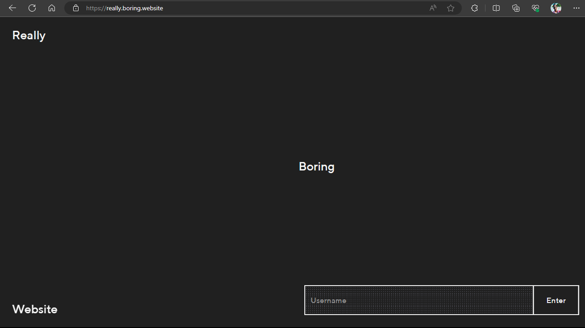

# CSS BASICS
- Web pages are meant to display information in form of images, text, tables etc. 
- Although all this can be achieved using only HTML code, the web experience would be boring and plain.
  
- CSS is a language used to ensure that the web page's presentation is catchy and intuitive. This way, the user has a good experience while browsing this web-page.
  
- 