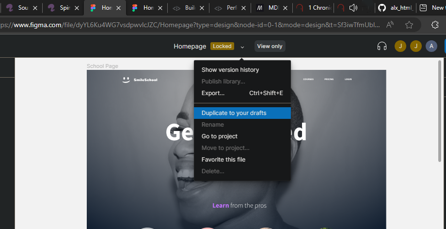

# HTML Advanced!

- The next step of this journey, is diving into advanced HTML.
- Now we develop our site, referencing a <a href="https://www.figma.com/file/dyYL6Ku4WG7vsdpwvlcJZC/Homepage?type=design&mode=design" title="Fig Ref" target="_blank">figma mockup</a> of the final result.
- We focus on all the html elements first and after that we can add style by creating and linking to a stylesheet.
- While working with the figma file, make sure to duplicate it so that you can access all the file's details and use them freely.
 
- This also makes sure our original file remains unchanged hence it retains its reference integrity, while you are able to experiment with the duplicate.
- The fonts to be used are;
  - <a href="https://www.fontsquirrel.com/fonts/source-sans-pro" title="Download Font" target="_blank">Source Sans Pro </a> from <em>San Serif</em> fonts,
  - <a href="https://www.fontsquirrel.com/fonts/Spin-Cycle-OT" title="Download Font" target="_blank">Spin Cycle</a> from <em>Display Fonts</em>
 
- You can preview the <a href="https://htmlpreview.github.io/?https://github.com/josephchigiz/alx_html_css/blob/master/html_advanced/index.html" title="Homepage" target="_blank"><em>rendered website</em></a> in it's current state, so that you can follow the development in real-time.
 
- **Happy Coding!** 🫡